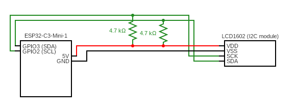

# ESP32 MTLS MQTT Weather Display

## About the project
This is an addon to the project [raspberry_pi_pico_temp_sensor_reader](https://github.com/lafftale1999/raspberry_pi_pico_temp_sensor_reader.git) where I publish sensor values to a Mosquitto MQTT broker. This system then subscribes to the same topic as the sensor device and then displays this on the LCD screen using my driver [lcd_1602_i2c_driver](https://github.com/lafftale1999/lcd_1602_i2c_driver.git). The connection is made over WIFI using MTLS.

If you need help with setting up a broker and generating certificates you can use this project: https://github.com/lafftale1999/Mosquitto_MQTT_Docker

## Pre-requesites

### 1. LCD 1602 I2C Driver
If you have already cloned the project and forgot to include the submodule, you can use this command:

`git submodule update --init --recursive`

### 2. ESP-IDF
The ESP IoT development framework. This supplies the necessary API:s for WIFI, MQTT and other essential functions for this system.

You can find a thorough guide on ESP and installation here: https://docs.espressif.com/projects/esp-idf/en/stable/esp32/get-started/index.html

### 3. GCC
Compiler for C code.

**For windows**  
[Guide for windows](https://medium.com/@anazilthottunghal/a-guide-to-installing-gcc-on-windows-5cc95c2f38c4)

**For Mac**  
`brew install gcc`

**For Linux**  
`sudo apt-get install gcc`

### 4. Cmake
This is the build tool for the project and routinely used for raspberry pi pico projects.

[You can download it here](https://cmake.org/download/)

### 5. Correctly connected system
This is an example of how I connected mine:



## Running the project

### 1. Clone repository
To clone the repository and necessary submodules use:

`git clone --recurse-submodules https://github.com/lafftale1999/esp32_mqtt_weather_display.git`

If you already cloned the project, but forgot to include the submodule you can run this command:

`git submodule update --init --recursive`

---

### 2. MTLS and certificates
To be able to use this system and connect to the MQTT broker you need the correct certificates. Add the following files to `credentials/certs/`

`ca.crt`, `client.crt` and `client.key`

**Note:** Important that the names are the same as shown above or the path will be incorrect. You can also update the path in the roots CMakeLists.txt if you have specific naming conventions to follow.

```
target_add_binary_data(${CMAKE_PROJECT_NAME}.elf "credentials/certs/client.crt" TEXT)
target_add_binary_data(${CMAKE_PROJECT_NAME}.elf "credentials/certs/client.key" TEXT)
target_add_binary_data(${CMAKE_PROJECT_NAME}.elf "credentials/certs/ca.crt" TEXT)
```

---

### 3. Update information
Update credentials in `credentials/credentials.h`
```c
#define WIFI_SSID   "admin"
#define WIFI_PASS   "password123"

#define MQTT_USERNAME   "mqtt_user"
#define MQTT_PASSWORD   "mqtt_pass"
```

Update the defines in **esp32_mqtt.h** to match your setup:
```c
#define MQTT_SERVER_ADDRESS     "192.168.61.111"
#define MQTT_MTLS_PORT          8883                // make sure this port supports mtls
#define MQTT_TOPIC              "/room_meas"        
#define MQTT_STANDARD_QOS       1

#define MQTT_PAYLOAD_MAX_LEN    256
#define MQTT_PARSED_MAX_LEN     256
#define MQTT_TOPIC_MAX_LEN      64
#define MQTT_WAIT_FOR_MUTEX_MS  50
#define MQTT_MAX_TRIES_SAVE     3

#define MQTT_JSON_TEMP_KEY      "temperature"
#define MQTT_JSON_HUM_KEY       "humidity"
#define MQTT_JSON_PRESS_KEY     "pressure"

#define TEMP_DIVISION_VAL       100.0f
#define HUM_DIVISION_VAL        1024.0f
#define PRESS_DIVISION_VAL      (256.0f * 100.0f) 

#define MQTT_RECONNECT_TRIES    5
#define MQTT_RECONNECT_REST_MS  1000
```

**Note:** Remember that changing the MQTT_JSON_XXX defines may cause the need to configure the function `parse_json_string()` in `esp32_mqtt.h`.

---

### 4. Build, flash and monitor
If you have installed the esp-idf extension in VScode you can easily do this by clicking the extension option in the ESP-IDF bar: `ESP-IDF: Build, Flash and Monitor`.

If you are doing this via the CLI (and PATH is correctly configured) you can use the following command from the root of this project:

`idf.py -p COM3 build flash monitor`

## About me
I'm currently studying to become an embedded developer and learning more about IoT systems. If you have any questions regarding the project - don't hesitate to ask!